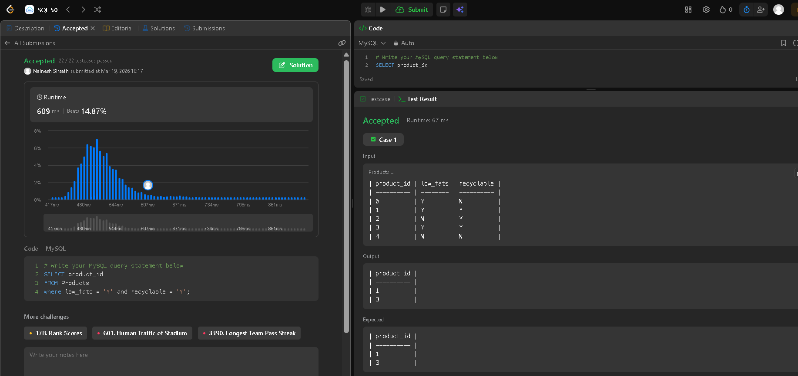
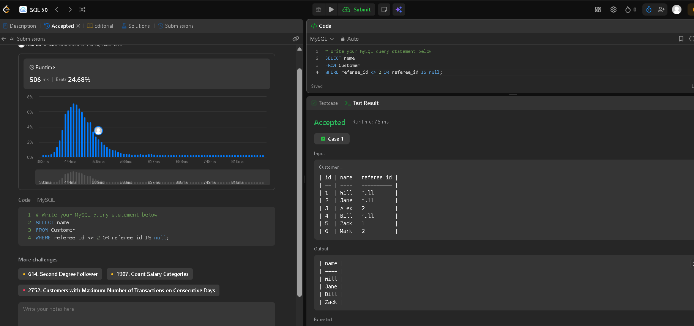
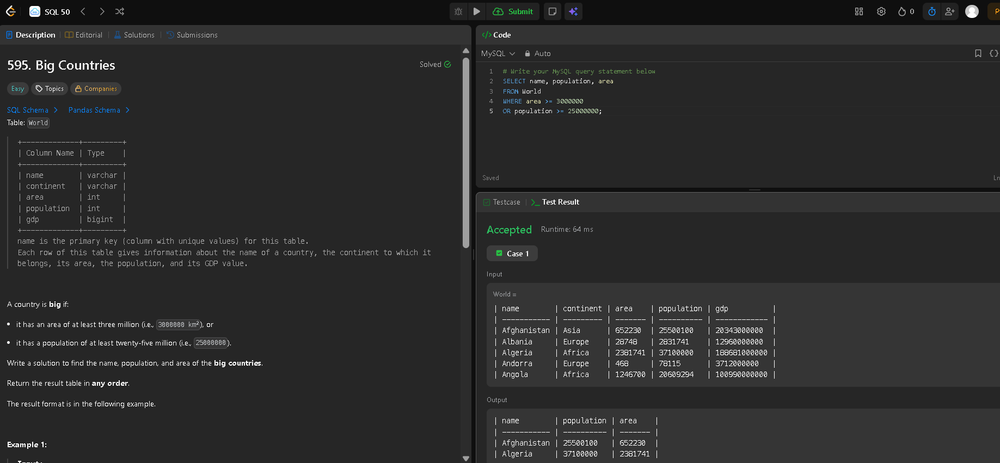
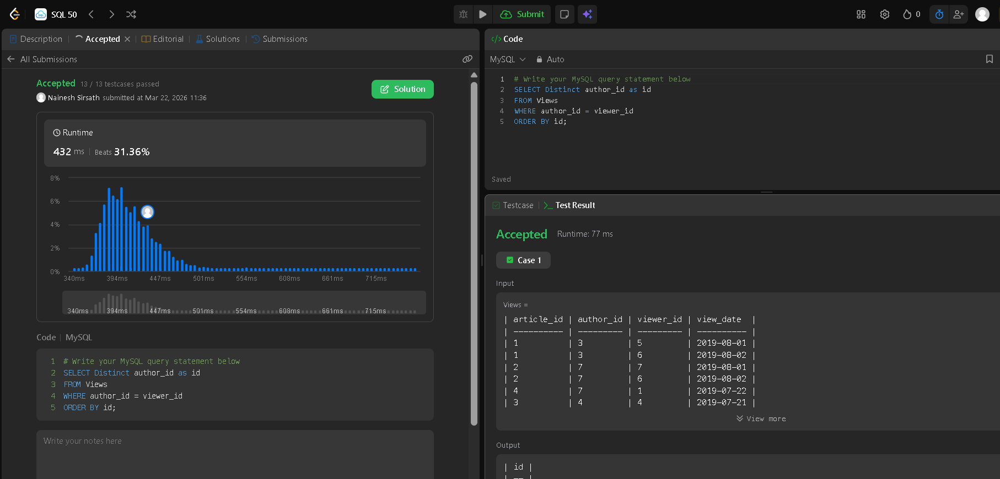
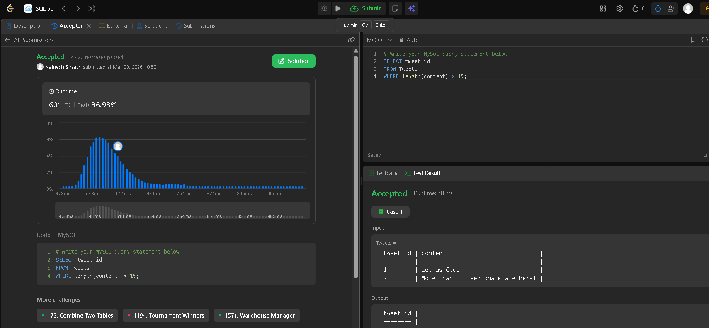
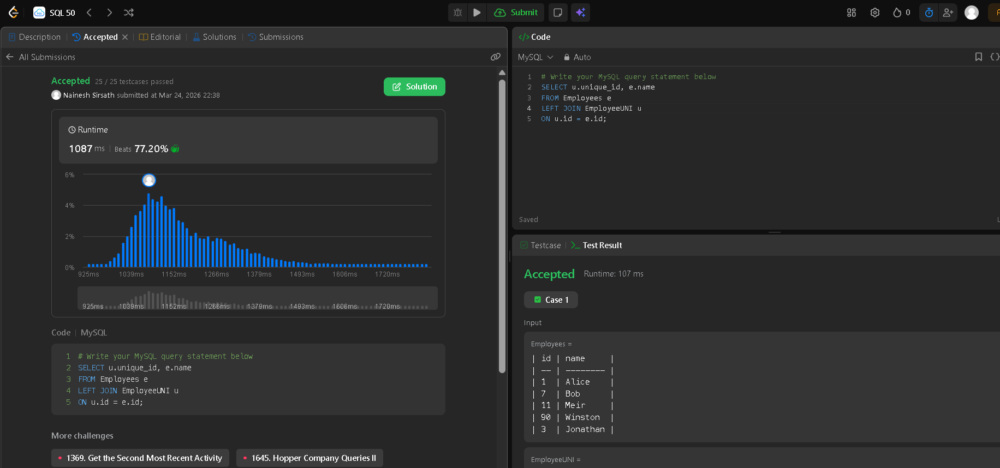
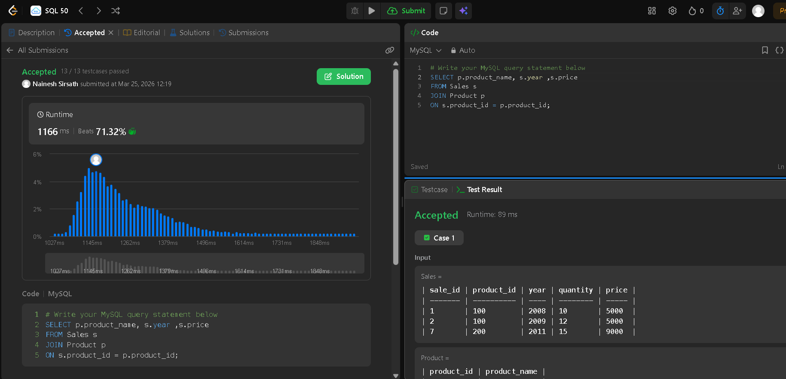
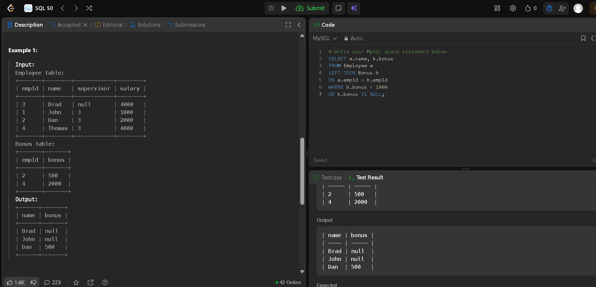
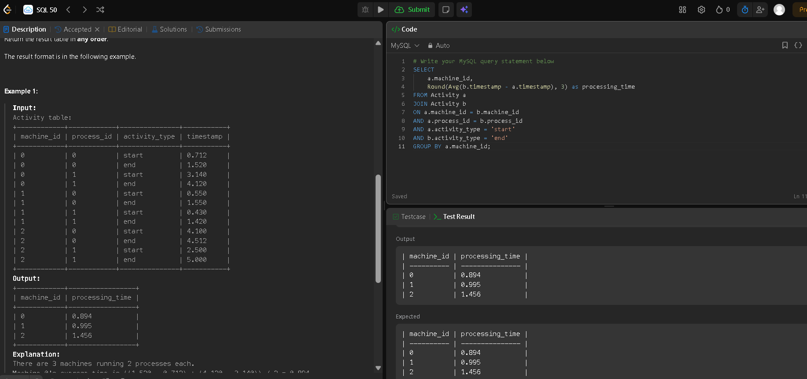
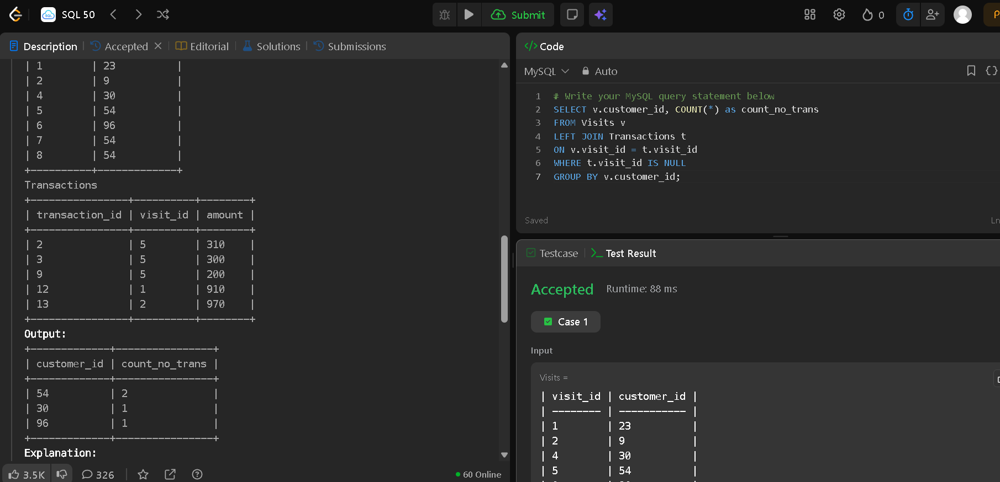

# LeetCode SQL 50 Solutions

This repository contains my solutions to SQL problems from LeetCode.

## Completed Problems

1. Recyclable and Low Fat Products

   * Used WHERE clause with AND condition
   * Filtered based on multiple columns
    ### Output Screenshot

  
  

2. Find Customer Referee

  * Used `WHERE` clause with `OR` condition
  * Handled `NULL` values using `IS NULL`
  * Filtered customers not referred by id = 2

  ### Output Screenshot:**

  

3. Big Countries

* Used `SELECT` to retrieve name, population, area
* Applied `WHERE` clause with `OR` condition
* Filtered countries based on:
  * area ≥ 3,000,000
  * OR population ≥ 25,000,000
 
  ### Output Screenshot:**

  

4. Article Views I
* Used SELECT DISTINCT to avoid duplicate author IDs
* Filtered records where the author viewed their own article
* Applied condition: author_id = viewer_id
* Sorted results using ORDER BY

  ### Output Screenshot:**

  

5. Invalid Tweets
* Used SELECT to retrieve tweet IDs
* Applied WHERE clause to filter invalid tweets
* Used LENGTH() function to check content size
* Condition: content length greater than 15 characters

 ### Output Screenshot:**

 

 6. Employees and Employee Unique IDs
* Used `LEFT JOIN` to combine Employees and EmployeeUNI tables
* Retrieved unique_id and employee name for all employees
* Handled cases where employees may not have a unique ID
* Ensured all employee records are included even if unique_id doesn't exist

### Output Screenshot:**
* 

 7. Product Sales Analysis
* Used `JOIN` to combine Sales and Product tables
* Retrieved product name, year, and price information
* Matched records using product_id foreign key
* Displayed sales data with corresponding product details

 ### Output Screenshot:**
 

 8. Employee Bonus
* Used `LEFT JOIN` to combine Employee and Bonus tables
* Retrieved employee name and bonus amount
* Matched records using empId foreign key
* Filtered employees with bonus less than 1000 or no bonus
* Handled `NULL` values to include employees without bonuses 

### Output Screenshot:**
 

9. Average Time of Process by Machine
* Used `JOIN` to combine Activity table with itself
* Retrieved machine_id and calculated average processing time
* Matched records using machine_id and process_id
* Filtered for 'start' and 'end' activity types
* Used `ROUND()` function to round result to 3 decimal places
* Grouped results by machine_id to aggregate processing times

  ### Output Screenshot:**
 

 9. Customers Who Never Made a Purchase

* Used `LEFT JOIN` to combine Visits and Transactions tables
* Retrieved customer_id and count of visits without transactions
* Matched records using visit_id foreign key
* Filtered visits with no corresponding transactions using `IS NULL`
* Used `GROUP BY` to aggregate results by customer
* Used `COUNT(*)` to count visits per customer

  ### Output Screenshot:**
 
 

More solutions coming soon
